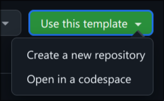
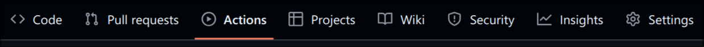
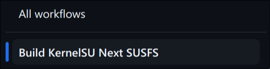
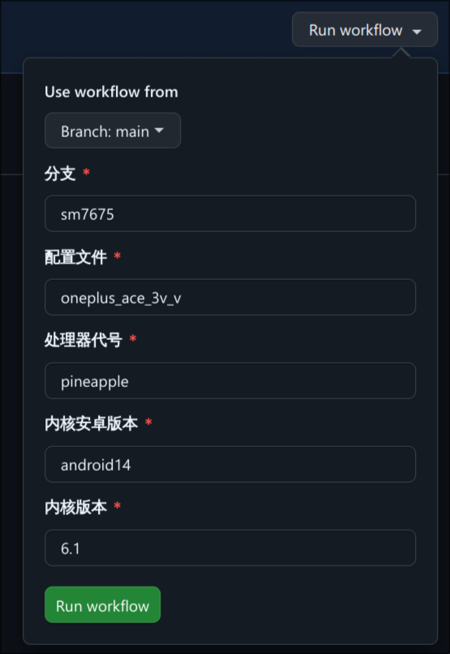
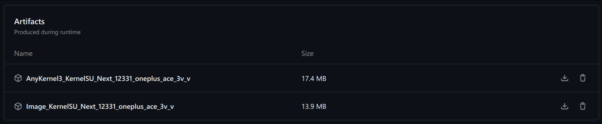

# Action-KernelSU-Next

Forked from [Laomaoi/Action-KernelSU-Next](https://github.com/Laomaoi/Action-KernelSU-Next)

## Usage

1. Create new repository using this template.

2. Goto Github Actions.

3. Select an action.

4. Fill the table and run an action.

Find your device from [OnePlusOSS/kernel_manifest](https://github.com/OnePlusOSS/kernel_manifest).

> It will cost about 2 hours to complete (with **Github pro** enabled).

5. Download the artifact from action.

- **AnyKernel3** is flashable in TWRP recovery or Kernel Flasher app.

- **Image** is the raw kernel file, which cannot be directly flashed.

## License

Unknown

> The license of this repository is following upstream [Laomaoi/Action-KernelSU-Next](https://github.com/Laomaoi/Action-KernelSU-Next).
